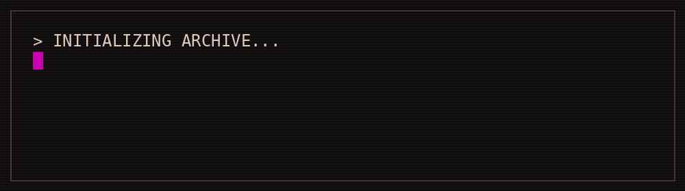
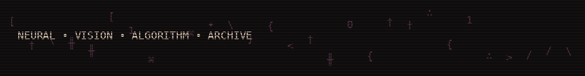
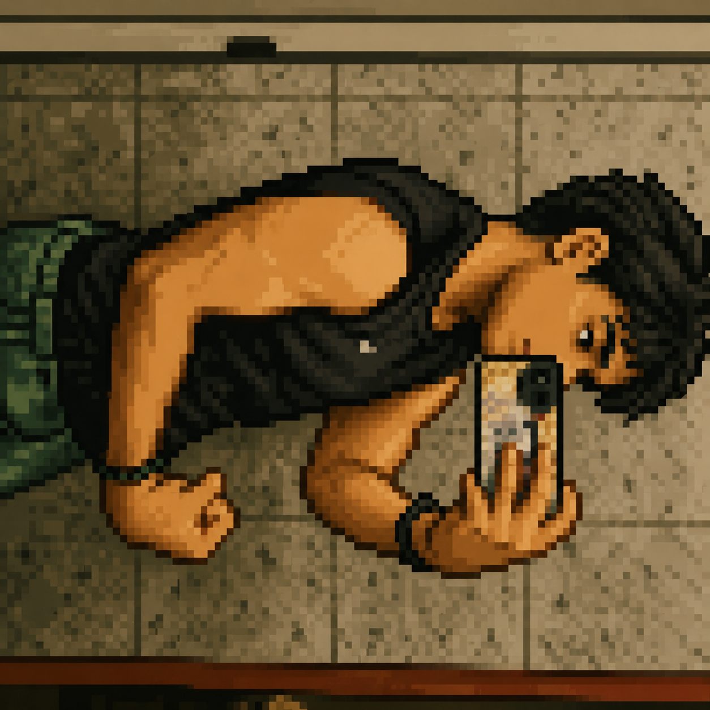

<p align="center">
  
</p>

<p align="center">
  
</p>

<p align="center">
  
</p>

---

<table>
<tr>
<td width="31%" align="center" valign="top">



<br>

<b>KARTIKEYA GUPTA</b>

<br><br>

<code>COMPUTER ENGINEERING</code><br>
<code>AI / ML</code>

</td>

<td width="69%" valign="top">

<h2>HI, I'M KARTIKEYA_</h2>

Computer Engineering student working at the intersection of <b>machine learning, deep learning, neural networks and algorithms</b>.

Currently moving deeper into <b>computer vision and Vision-Language Models (VLMs)</b> — learning how machines can not only process information, but interpret it.

I like understanding how things work underneath the abstraction, then building something with that knowledge.

<br><br>

<blockquote>
<b>❝ This is how change happens, one gesture, one person, one moment at a time. ❞</b>
</blockquote>

</td>
</tr>
</table>

---

## ⚗ MY ARSENAL

<table>
<tr>
<td align="center"><b>LANGUAGES</b></td>
<td align="center"><b>ML / AI</b></td>
<td align="center"><b>DATA / VISION</b></td>
<td align="center"><b>TOOLS</b></td>
</tr>
<tr>
<td align="center">
<code>C++</code><br>
<code>Python</code><br>
<code>HTML</code><br>
<code>CSS</code>
</td>
<td align="center">
<code>PyTorch</code><br>
<code>Neural Networks</code><br>
<code>Deep Learning</code><br>
<code>NLP</code><br>
<code>VLMs</code>
</td>
<td align="center">
<code>NumPy</code><br>
<code>Pandas</code><br>
<code>Matplotlib</code><br>
<code>Seaborn</code><br>
<code>Computer Vision</code>
</td>
<td align="center">
<code>Git</code><br>
<code>GitHub</code>
</td>
</tr>
</table>

<p align="center">
<sub>✦ THE STACK IS NOT A CHECKLIST. IT IS AN ARSENAL. ✦</sub>
</p>

---

## 📜 CURRENTLY INSCRIBING

```text
╭──────────────────────────────────────────────────────────────╮
│                                                              │
│   [01] VISION                                                │
│        Computer Vision                                      │
│                                                              │
│   [02] LANGUAGE                                              │
│        Vision-Language Models                                │
│                                                              │
│   [03] INTELLIGENCE                                          │
│        Deep Learning / Neural Networks                       │
│                                                              │
│   [04] ALGORITHM                                             │
│        Data Structures & Algorithms                           │
│                                                              │
╰──────────────────────────────────────────────────────────────╯
```

---

## 🜏 THE WORKSHOP

Most of the actual experiments, projects and unfinished machinery live in the repositories below.

**The profile is the archive.  
The repositories are the workshop.**

<p align="center">

<a href="https://github.com/kartikeyag-13?tab=repositories">
  
</a>

</p>

---

## ☩ CONTRIBUTION MANUSCRIPT

<p align="center">
  
</p>

<p align="center">
  
</p>

---

## ⚔ MANIFESTO

```text
BUILD      → because curiosity is useless without making.
BREAK      → because understanding requires failure.
LEARN      → because yesterday's abstraction becomes tomorrow's tool.
REPEAT     → because mastery is mostly stubbornness.
```

<p align="center">
<code>NEURAL SYSTEMS</code> ·
<code>VISION</code> ·
<code>ALGORITHMS</code> ·
<code>EXPERIMENTS</code>
</p>

---

<p align="center">
  <sub>────────────── ✦ ──────────────</sub>
  <br>
  <sub>KARTIKEYA GUPTA · DIGITAL ARCHIVE · EST. 20XX</sub>
  <br>
  <sub><i>crafted somewhere between a manuscript and a machine</i></sub>
</p>
