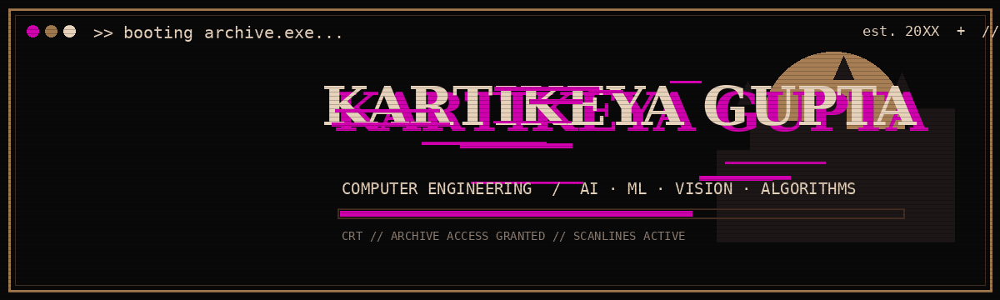
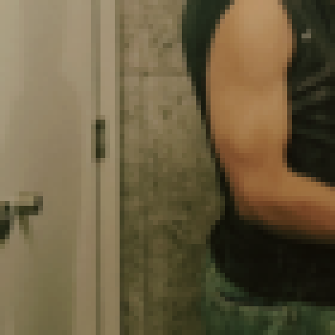
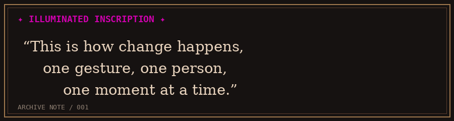
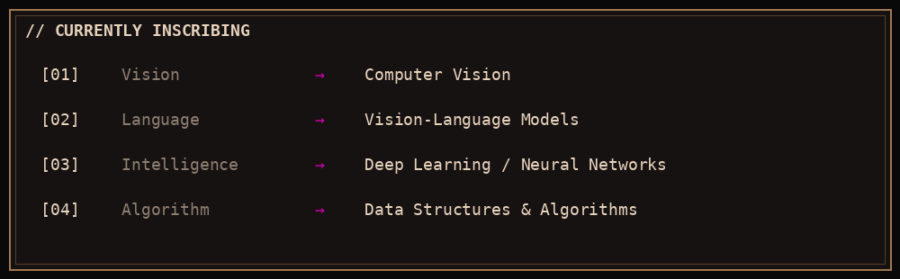
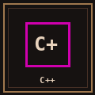
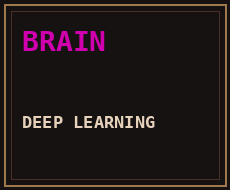
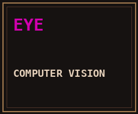
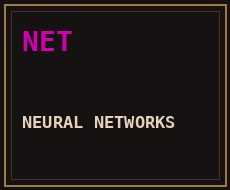
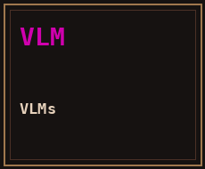
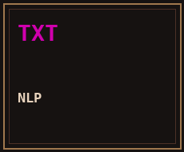

<p align="center">
  
</p>

<table>
<tr>
<td width="34%" align="center" valign="middle">



<br><br>

<code>KARTIKEYA_13</code><br>
<code>COMPUTER ENGINEERING</code><br>
<code>AI / ML</code>

</td>

<td width="66%" valign="top">

# HI, I'M KARTIKEYA_

Computer Engineering student working at the intersection of **machine learning, deep learning, neural networks and algorithms**.

Currently moving deeper into **computer vision and Vision-Language Models (VLMs)** — learning how machines can not only process information, but interpret it.

I like understanding what happens underneath the abstraction, then building with that knowledge.

<br>



</td>
</tr>
</table>

---

# 📜 CURRENTLY INSCRIBING



---

<p align="center">
  <code>MONA.EXE IS WANDERING THROUGH THE ARCHIVE...</code>
</p>

<p align="center">
  
</p>

---

# ⚔ MY ARSENAL

<p align="center">

<a href="https://isocpp.org/"></a>
<a href="https://www.python.org/"></a>
<a href="https://developer.mozilla.org/en-US/docs/Web/HTML"></a>
<a href="https://developer.mozilla.org/en-US/docs/Web/CSS"></a>
<a href="https://git-scm.com/"></a>
<a href="https://github.com/"></a>
<a href="https://numpy.org/"></a>
<a href="https://pandas.pydata.org/"></a>
<a href="https://pytorch.org/"></a>
<a href="https://matplotlib.org/"></a>
<a href="https://seaborn.pydata.org/"></a>

</p>

<p align="center">
<sub>click the glyphs to open the scrolls</sub>
</p>

---

# ✦ AREAS OF FOCUS

<p align="center">





</p>

---

# ⚔ MANIFESTO

```text
BUILD  → because curiosity is useless without making.
BREAK  → because understanding requires failure.
LEARN  → because yesterday's abstraction becomes tomorrow's tool.
REPEAT → because mastery is mostly stubbornness.
```

<p align="center">
  <code>NEURAL SYSTEMS</code> ·
  <code>VISION</code> ·
  <code>ALGORITHMS</code> ·
  <code>EXPERIMENTS</code>
</p>

<p align="center">
<sub>✦ KARTIKEYA GUPTA · DIGITAL ARCHIVE · EST. 20XX ✦</sub>
<br>
<sub><i>the archive is always growing...</i></sub>
</p>
