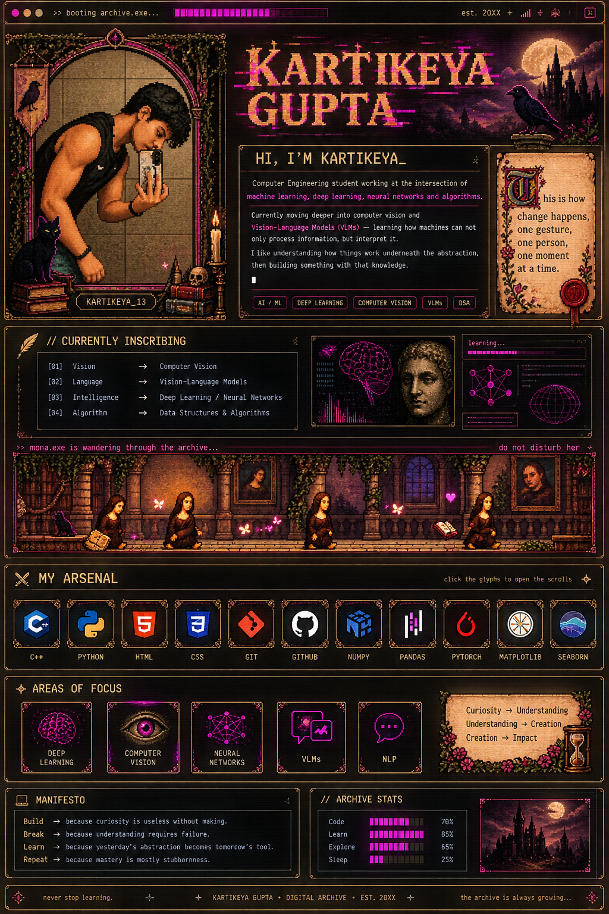
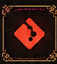
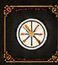
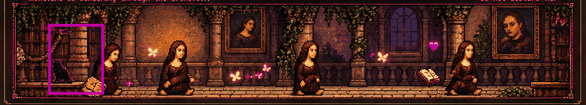

<p align="center">
  
</p>

> **Pixel-perfect visual reference:** the supplied design is preserved as `assets/archive-profile.png`.
> GitHub does not execute arbitrary CSS/JavaScript in README files, so the complex visual treatment is baked into the artwork while the interactive layer below remains real Markdown/HTML.

---

# ⚔ MY ARSENAL

<p align="center">
<a href="https://isocpp.org/"></a>
<a href="https://www.python.org/"></a>
<a href="https://developer.mozilla.org/en-US/docs/Web/HTML"></a>
<a href="https://developer.mozilla.org/en-US/docs/Web/CSS"></a>
<a href="https://git-scm.com/"></a>
<a href="https://github.com/"></a>
<a href="https://numpy.org/"></a>
<a href="https://pandas.pydata.org/"></a>
<a href="https://pytorch.org/"></a>
<a href="https://matplotlib.org/"></a>
<a href="https://seaborn.pydata.org/"></a>
</p>

<p align="center">
<sub>C++ · Python · HTML · CSS · Git · GitHub · NumPy · Pandas · PyTorch · Matplotlib · Seaborn</sub>
</p>

---

# 🜏 THE ARCHIVE

**Kartikeya Gupta** — Computer Engineering student working with **machine learning, deep learning, neural networks, computer vision and data structures & algorithms**.

Currently moving deeper into **computer vision and Vision-Language Models (VLMs)**.

> *This is how change happens, one gesture, one person, one moment at a time.*

---

# 📜 CURRENTLY INSCRIBING

```text
[01] Vision        → Computer Vision
[02] Language      → Vision-Language Models
[03] Intelligence  → Deep Learning / Neural Networks
[04] Algorithm     → Data Structures & Algorithms
```

---

# 🖼 MONA.EXE

<p align="center">
  
</p>

<p align="center"><code>MONA.EXE IS WANDERING THROUGH THE ARCHIVE...</code></p>

---

# ✦ AREAS OF FOCUS

`DEEP LEARNING` · `COMPUTER VISION` · `NEURAL NETWORKS` · `VLMs` · `NLP`

---

# ⚔ MANIFESTO

```text
BUILD  → because curiosity is useless without making.
BREAK  → because understanding requires failure.
LEARN  → because yesterday's abstraction becomes tomorrow's tool.
REPEAT → because mastery is mostly stubbornness.
```

<p align="center">
<sub>never stop learning · KARTIKEYA GUPTA · DIGITAL ARCHIVE · EST. 20XX</sub>
</p>
